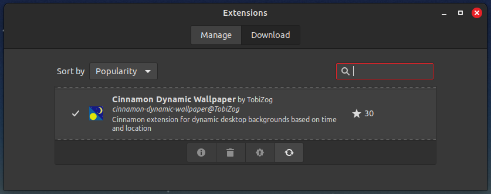

# Cinnamon Dynamic Wallpaper


## About the project
This extension switches the background image of your Cinnamon desktop multiple times in a day, based on a location or custom time periods. You can choose between included image-sets, your own HEIC-file or a source folder with single images. Configuration through a user-friendly configuration window.

### Features
- 9 included image sets
- 10 day periods
- HEIF converter
- Image configuration assistent with simple one-click setup for image choices
- Online location estimation (three provider) or offline with manual latitude and longitude input
- Time periods individual configured by user
- Offline sun angles estimation
- Image stretching over multiple displays or repeat image for every display
- Creating a color gradient based on the current wallpaper for images which not fill the whole screen

### Tested Cinnamon versions
- 5.4 (Mint 21)
- 5.6 (Mint 21.1)
- 5.8 (Mint 21.2)
- 6.0 (Mint 21.3)
- 6.2 (Mint 22)

### Technology
- `JavaScript`
	- Display desktop notifications
	- Calling the Python loop script every 60 seconds to refresh the background image
- `Python`
	- Handles the preference window
	- Esimates the location
	- Changes of the desktop wallpapers
- `Glade`
	- Preference window UI design
---
## Installation
### From Built-in Extension Manager


1. Open "Extensions" in Linux Mint or any other distribution with Cinnamon as Desktop Environment
2. Click on "Download"
3. Search and download it

### From the repo
1. Download the latest from the Releases page on GitHub: https://github.com/TobiZog/cinnamon-dynamic-wallpaper/releases
2. Extract the files
3. Copy the folder `cinnamon-dynamic-wallpaper@TobiZog` to `~/.local/share/cinnamon/extensions/`
---
## Usage
1. Active the Extension via Cinnamon Extension Manager
2. Open the settings
3. Configure it to your 
	- You can apply the setted settings without closing the window if you click on "Apply"
4. If your config is complete, click on "OK"
---
## Preferences Window
Because of the lack of configuration options in the standard Cinnamon configuration system for extensions offers this extension a custom preference window.  
All configuration will be handled there. You can choose between included image sets, a HEIC file or a folder source and set the image to ten different daytime periods. Time periods will be estimated via network, custom coordinations or custom time periods. Some behaviour preferences (strech image, fill empty background with gradient color) are also here.


---
## Troubleshooting
### General
At first: Check if the extension is installed AND activated (check symbol on the left in Extension window).


Many errors on Linux Mint/Cinnamon Desktop will be printed to Melange. You can open it by pressing `Super Key` + `L`.

### The Preference Window doesn't open!
Go to your home directory, open the terminal. Execute the command:

```
python3 .local/share/cinnamon/extensions/cinnamon-dynamic-wallpaper@TobiZog/5.4/src/main.py
```

This will manually start the window. If there are any problems, the terminal will show it. Use these informations to fix the problem or add them to the Issue.

### The extension don't change the wallpaper
Go to your home directory, open the terminal. Execute the command:

```
python3 .local/share/cinnamon/extensions/cinnamon-dynamic-wallpaper@TobiZog/5.4/src/main.py loop
```

It executes the loop-function which handles the wallpaper change. Terminal will show errors. Use these informations to fix the problem or add them to the Issue.

---
## Contribute
### Translation
You want to contribute a language which isn't supported yet? Here is how to do:

1. Fork the cinnamon-spices-extensions project: https://github.com/linuxmint/cinnamon-spices-extensions
2. Pull the repository
3. Open `cinnamon-dynamic-wallpaper@TobiZog/files/cinnamon-dynamic-wallpaper@TobiZog/po/cinnamon-dynamic-wallpaper@TobiZog.pot` with a po-tool like poedit (https://poedit.net/).
4. Create a new translation in your language
5. Push the changes to your repository
6. Create a pull request

---
## Included image sets
The image sets are from https://github.com/adi1090x/dynamic-wallpaper

| Aurora | Beach | Bitday |
| ------ | ----- | ------ |
|  |  |  |

| Cliffs | Desert | Earth |  
| -------- | --------- | --------- |
|  |  |  | 

| Gradient | Island | Lake |
| --- | --- | --- |
 |  |  | 

| Lakeside | Mountains | Sahara |
| --------- | ------ | ------ |
|  |  |  |